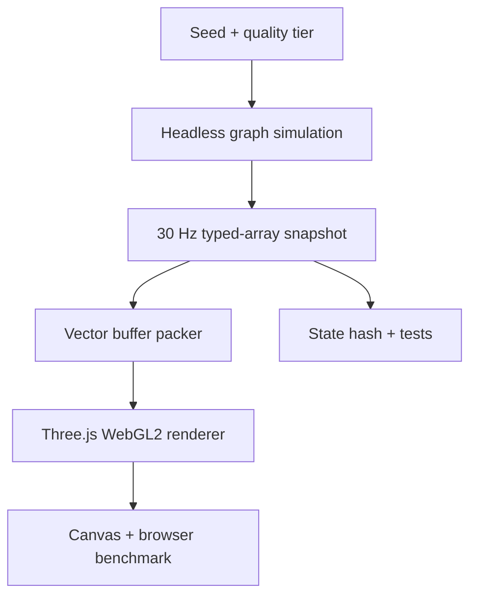

# Runtime architecture

P02 establishes an executable boundary, not the final trained phenotype. The
headless runtime is authoritative; rendering, cameras, benchmark overlays, and
future spectral post-processing consume snapshots and cannot mutate simulation
truth.

## Runtime flow

The same `VectorBufferPacker` runs in the Node benchmark and the visible browser
renderer. This keeps node, edge, and sparse-ribbon preparation measurable without
requiring a DOM or GPU in deterministic tests.

## Source boundaries

| Directory | Responsibility | May depend on Three.js/DOM? |
|---|---|---|
| `src/simulation` | Fixed timestep, graph state, seeded gates, lifecycle fixture, hashes | No |
| `src/nca` | Versioned learned-update fixture and model metadata | No |
| `src/rendering` | Vector buffer packing, Three.js scene, inspectable GLSL probes | Packer: no; renderer: yes |
| `src/spectral` | Wavelength conversion, semantic events, linear-light look profiles | No |
| `src/environments` | Home graybox presentation geometry | Yes |
| `src/platform` | Capability detection, quality selection, DPR/long-edge caps | Pure helpers plus browser detector |
| `src/benchmark` | Percentiles, browser paired benchmark, GPU throughput probes | Statistics: no; GPU probes: yes |
| `src/ui` | Status, fallback, controls, benchmark evidence panel | Yes |
| `src/export` | Benchmark JSON plus final-canvas PNG/video color contract | Browser capture only |
| `tests` | Determinism, headless execution, pacing, packing, quality policy | No renderer |

## Simulation clock

- Simulation cadence is fixed at 30 Hz (`dt = 1/30 s`).
- Rendering interpolates between the previous and current typed-array snapshots.
- At most four ticks may catch up in one rendered frame.
- Excess wall time is dropped; the simulation never switches to a variable step.
- Visibility changes reset the wall-clock accumulator.
- Camera, quality presentation, and rendering do not enter the state hash.

## Learned-update fixture

`reference-fixture-v1` is a deterministic two-layer local neural update with 24
hidden channels. It exists to put representative learned math and vector packing
under one benchmark. It is not presented as a trained organism.

Model metadata and the weight seed are versioned in
`src/nca/models/reference-fixture-v1.json`. Runtime run seeds affect organism
state and asynchronous fire gates, never model weights.

## Rendering path

The selected P02 renderer uses:

- one instanced icosahedral node draw;
- one dynamic line-segment draw for graph edges;
- one sparse indexed ribbon draw;
- a high-key Home cutaway graybox;
- tiered antialiasing, shadows, DPR, and resolution caps;
- a 42° architectural camera with orbit, pan, zoom, and recenter.

P03 adds a pure wavelength-to-linear-sRGB core and a presentation-only spectral
layer. HDR emitter geometry is separate from neutral geometry, bloom thresholds
exclude ordinary white surfaces, and `OutputPass` owns the single sRGB transfer.
The simulation snapshot still stores energy and health rather than display RGB.

## Capability and failure policy

WebGL2 is the minimum visible renderer. If it is unavailable, the application
shows a readable compatibility card and a valid headless state hash; it never
leaves a blank canvas. WebGPU availability is recorded but is not required.

Quality defaults to Mobile for coarse-pointer, ≤4 GB device-memory, or ≤4-core
signals; otherwise it defaults to Desktop. A URL query or UI selection may
override the tier. Quality changes reload at a clean simulation boundary rather
than changing node capacity mid-run.

## Static hosting

Vite builds with `base: './'`, so `dist/` can be hosted from a subdirectory or
static object store. No API, database, server-side rendering process, or runtime
secret is required. Model and shader assets remain repository-versioned and
inspectable.
