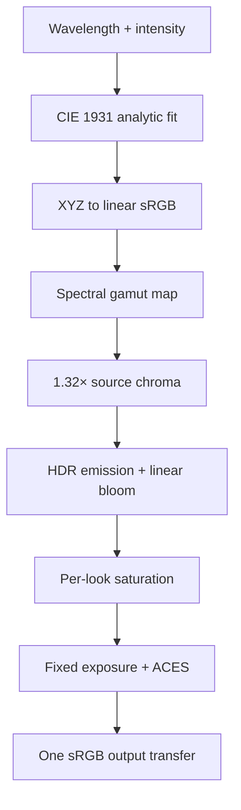

# P03 spectral color pipeline

P03 establishes one output path for the live renderer, calibration tools, PNG
captures, and the future video encoder. Wavelength, intensity, and event meaning
are simulation-facing data. Display RGB is never authored by hand.

## Pipeline

All color values before the final transfer are linear-light values. Neutral
material colors, spectral emission, additive paths, bloom, exposure, and ACES
operate before sRGB encoding. The final `OutputPass` performs the only display
transfer.

## Wavelength conversion

`src/spectral/color.ts` uses the analytic CIE 1931 2° color-matching-function fit
described by Wyman, Sloan, and Shirley, followed by the standard XYZ-to-linear-
sRGB matrix.

The spectral locus exceeds the sRGB gamut. The implementation adds the smallest
neutral component required to remove negative channels, then peak-normalizes the
result. A deterministic **1.32× source-chroma gain** expands the distance from
neutral at the same peak intensity. Channels that leave sRGB are clipped at the
boundary rather than diluted with more white. Dominant-channel order and the
470–620 nm semantic direction remain unchanged.

The analytic CIE fit remains defined across 380–780 nm internally, but every
authored emission is hard-clamped to **470–620 nm** before display conversion.
Requests below 470 nm resolve to the 470 nm endpoint; requests above 620 nm
resolve to the 620 nm endpoint. Violet and far-red tails cannot enter the live,
PNG, or video presentation path.

**Blue is life. Red is death.** The 470 nm blue endpoint belongs to feeding,
health, and completed regeneration. The 620 nm red endpoint is reserved for
death. Intermediate cyan, green, amber, and orange communicate movement between
those semantic poles without changing their meaning.

## HDR intensity and white-energy behavior

Spectral chromaticity is multiplied by event intensity in linear light. Above
4.25×, a restrained neutral component increases smoothly. After bloom, a
per-look saturation pass raises separation between color channels while leaving
neutral pixels mathematically neutral. ACES then rolls the hottest highlights
toward white without flattening the working range too early.

The default Porcelain Spectrum settings are:

| Setting | Value |
|---|---:|
| Source chroma gain | 1.32× |
| Output saturation | +0.18 |
| Exposure | 0.86 |
| Bloom strength | 0.34 |
| Bloom radius | 0.12 |
| Bloom threshold | 1.00 linear |
| Working space | Linear sRGB |
| Tone map | Three.js ACES filmic |
| Output transfer | sRGB, once |

Ordinary white architecture stays below the bloom threshold. Only the dedicated
HDR emissive node, graph-edge, source, fault, and transfer-path layers feed the
bloom pass.

## Semantic event system

Color is paired with a different spatial motion and form response for every
semantic state. Hue is never the only distinction.

| Event | Wavelength behavior | Motion | Form cue |
|---|---|---|---|
| Feeding | 479→470 nm, converging on life blue | Source → agent | Directed transfer wave |
| Hazard | Restrained 572–587 nm band | Held at boundary | Stationary tension |
| Damage | 590→614 nm, approaching but never reaching death red | Contact → graph | Fracture and recoil |
| Regeneration | 488→470 nm, completing at life blue | Survivor → growth | Outward reconstruction |
| Mutation | One restrained 521–566 nm middle-band pulse | Confined subgraph pulse | Topology pulse |
| Death | Fixed 620 nm red with intensity fade | Collapse → source | Retraction and extinction |
| Inspection | Low-intensity 508–572 nm band | Static channel band | Diagnostic only |

In the current Home graybox, the feeding threshold emits an ordered wave along a
named transfer path. The damage fault holds red/fracture energy at the wall. NCA
nodes and graph edges emit only when their energy rises above the neutral
baseline or health falls below one.

## Looks

P03 supplies one spectral response profile for each future authored look. P12
will complete the material and geometry representation of those looks.

| Look | Exposure | Bloom | Saturation | Emission scale | Intent |
|---|---:|---:|---:|---:|---|
| Porcelain Spectrum | 0.86 | 0.34 | +0.18 | 1.00 | Dense primary causal emission |
| Technical Wire | 0.94 | 0.14 | +0.10 | 0.58 | Restrained drafting response |
| Ghost Volume | 0.78 | 0.27 | +0.15 | 0.82 | State visible inside translucent forms |

Changing a look never changes wavelength, event state, NCA state, or the neutral
balance of white material inputs.

## Calibration and debug route

Open `?calibration=1` to display:

- 17 wavelength swatches across the 470–620 nm authored clamp;
- six emission strengths from 0.25× through 8×;
- neutral-white comparison plates;
- six semantic motion/form markers;
- a live probe for wavelength, intensity, and exposure;
- **Linear RGB**, **Display RGB**, tone-map, and output-stage readouts.

The `look` query or UI control accepts `porcelain`, `technical`, or `ghost`. The
**Save PNG** control captures the final canvas after bloom, ACES, and sRGB output.

Run `npm run capture:spectral` to regenerate the committed 1536×1024 CPU contract
reference. Its dimensions, SHA-256 digest, wavelength clamp, life/death anchors,
chroma/saturation grade, tone-map name, and single-output-transfer rule are
recorded next to the PNG in
`assets/reference/spectral-calibration-reference.json`.

## Live, PNG, and video agreement

Live output is the post-processed WebGL canvas. PNG export calls `toBlob()` on
that same canvas; no second shader or color conversion is involved. The video
handoff exposes `canvas.captureStream()` from the same final canvas, so P14 can
encode frames without re-rendering them through another transfer function.

The verification tolerance is:

- live vs PNG: at most 1/255 per decoded sRGB channel, excluding browser
  compositing outside the canvas;
- live vs decoded video: target mean absolute error at most 2/255 per sRGB
  channel, with local codec error permitted but no systematic gamma shift;
- neutral patches: maximum channel spread 1/255 in lossless PNG and 2/255 in
  decoded video.

P14 owns codec/container selection and will record decoded video evidence against
this contract. It may not introduce a second gamma pass.
