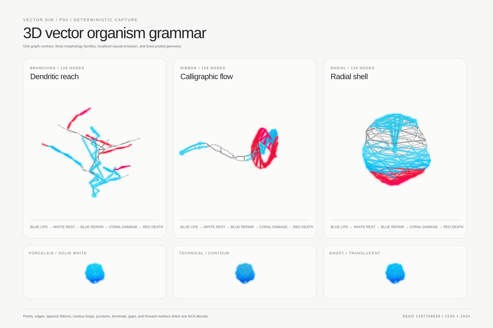
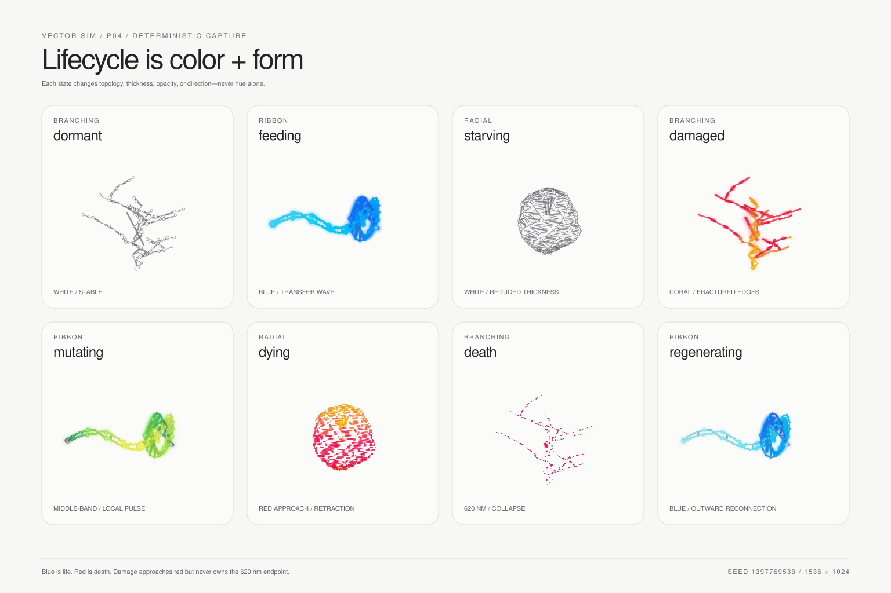

# P04 3D vector-agent visual system

P04 turns the benchmark fixture into a designed organism family. The visible
agent is still the simulation graph: cells are weighted nodes, adjacency is
structure, selected edges become tapered ribbons, and pooled triangle facets
turn the graph into a translucent low-poly constellation. Semantic state changes
the form without replacing it with a conventional creature mesh.





## Reference basis

The supplied [Spectral Homestead overview](../assets/concepts/spectral-homestead/spectral-homestead-overview-01.jpeg)
is the visual north star for scale and delicacy. P04 translates its fine angular
constellations, irregular translucent planes, clustered wire structures, and
restrained spectral trails into deterministic graph topology. The reference is
directional rather than literal: organisms remain abstract simulation drawings,
not conventional animal meshes copied from the image.

## Shared visual grammar

Every family uses the same constrained vocabulary:

- weighted icosahedral points for core, structural, junction, and terminal cells;
- straight or curved graph edges with intentional retraction gaps;
- tapered two-triangle ribbons on calligraphic, contour, and selected branch edges;
- sparse triangle facets and contour loops that read as vector planes rather than solid animal skin;
- instanced five-sided forward markers, separate from simulation state;
- white dormant material with event-gated 470–620 nm emission.

The scene owns one node instance batch, one base edge batch, one emission edge
batch, one ribbon batch, one facet batch, and one direction-marker batch. An
update changes typed-array values only. Death, reconnection, and LOD collapse
edges and triangle facets toward their centers instead of creating or destroying
Three.js objects.

## Morphology families

| Family | Topology | Silhouette | Direction cue |
|---|---|---|---|
| Branching | Angular trunk, primary forks, secondary forks, and sparse branch facets | Asymmetric dendritic constellation with explicit junctions and terminals | Trunk growth axis |
| Ribbon | Paired rails, alternating braces, and triangulated folds | Tapered spectral trail with a folded low-poly cage | Leading terminal along the sweep |
| Radial | Eight twisted spokes, ring contours, diagonals, and a faceted shell | Irregular halo or cellular polyhedron with terminal spikes | Normal of the radial plane |

Stable organism IDs combine the unsigned run seed with a seeded 32-bit identity.
Each node keeps a stable parent, role, importance, organism index, and buffer
slot. Faces reference stable node triples. The generated graph never exceeds
degree eight.

## NCA-to-geometry decode

The hidden state remains renderer-independent. P04 gives its first six channels
a versioned decoded role; they do not map directly to arbitrary color.

| Source | Visible output |
|---|---|
| Channels 0–2 | Restrained XYZ micro-offset and local activity |
| Channel 3 | Structural thickness |
| Channel 4 | Curvature around the organism centerline |
| Channel 5 | Connection gate used by edge/ribbon retraction |
| Energy | Feeding state, thickness support, blue transfer permission |
| Health + previous health | Damage, dying, death, or regeneration state |
| Static node role | Core/junction/terminal scale and LOD importance |
| Semantic event | Allowed wavelength and emission intensity only |

`nca=frozen` holds the hidden channels fixed. Environment energy and health can
still be inspected, but learned deformation stops; tests assert that the latent
buffer remains byte-identical across frozen ticks.

## Lifecycle language

| State | Color permission | Form behavior |
|---|---|---|
| Dormant | None | Stable white graph |
| Feeding | Blue life band | Thickened nodes and directed transfer |
| Starving | None | Reduced thickness and ribbon weight |
| Damaged | Coral/orange-red below 620 nm | Curvature fault and partial edge gaps |
| Mutating | Restrained middle band | Local topology pulse |
| Dying | Approaches red | Strong edge retraction and collapse |
| Death | Exclusive 620 nm red | Near-total connection collapse and extinction |
| Regenerating | Returns toward 470 nm blue | Outward reconnection from survivors |

## LOD without semantic loss

The topology assigns importance `0` to braces/micro-contours, `1` to ordinary
structure, and `2` to cores, junctions, terminals, and silhouette edges.

| LOD | Distance intent | Preserved detail |
|---|---|---|
| Overview | Room-scale | Importance 2 |
| Mid | Organism group | Importance 1–2 |
| Macro | Inspection | All detail |

Mobile selects a lower LOD slightly sooner, but node capacity, lifecycle state,
field semantics, and color meaning remain unchanged.

## Deterministic capture harness

Open a stable browser capture with:

```text
?organisms=1&seed=1397769539&tick=180&state=feeding&look=porcelain&distance=mid&nca=frozen
```

Parameters:

| Query | Values |
|---|---|
| `seed` | decimal or `0x` unsigned 32-bit seed |
| `tick` | `0–900`; supplying it pauses the run at that tick |
| `state` | dormant, feeding, starving, damaged, mutating, dying, death, regenerating |
| `look` | porcelain, technical, ghost |
| `distance` | overview, mid, macro |
| `nca` | live, frozen |

State override is presentation-only and excluded from the simulation hash. Run
`npm run capture:organisms` to regenerate the two committed 1536×1024 CPU vector
references and their SHA-256 manifest.

## Performance evidence

The 2026-08-07 Node reference run includes the new graph adjacency, visual
decoder, dynamic gaps, and full ribbon buffers.

| Tier | Nodes | Edges | Faces | Paired tick + pack median | P95 | Budget |
|---|---:|---:|---:|---:|---:|---:|
| Mobile | 512 | 905 | 392 | 0.830 ms | 1.076 ms | Simulation P95 ≤8 ms |
| Desktop | 2,048 | 3,671 | 1,598 | 3.151 ms | 3.465 ms | Simulation P95 ≤4 ms |

These are CPU reference measurements, not physical Safari evidence. P02 still
owns the deferred Mac and iPhone browser captures.

## Creative approval gate

Automated tests cover family identity, graph degree, pooled-buffer reuse,
lifecycle decode, exclusive death red, frozen NCA, stable capture parsing, and
LOD monotonicity. P04 remains open until the morphology and lifecycle references
are creatively approved and a physical browser view confirms junction and
terminal quality at Overview and Macro distances.
