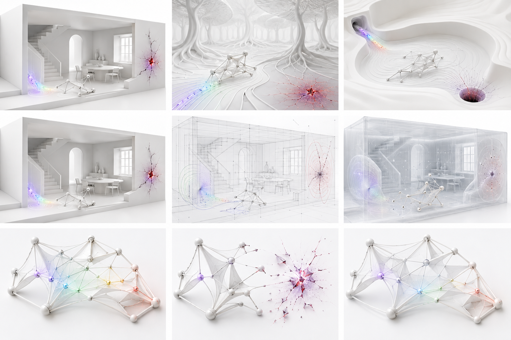

# Spectral Homestead reference atlas

**Asset:** `assets/reference/spectral-homestead-reference-atlas.png`  
**Dimensions:** 1536 × 1024 PNG  
**Purpose:** P01 source of truth for tone, causal color placement, environment
family resemblance, rendering looks, and organism-state readability.

The image is a conceptual target, not a literal asset sheet. Generated geometry,
furniture, trees, and basin forms are not production models. The written
contracts override incidental details in the image.

## Panel map

| Panel | Subject | Normative reading | Do not copy literally |
|---:|---|---|---|
| 1 | Home | White cutaway architecture; feeder and kill fault are spatially legible; graph organism stays neutral between events. | Exact furniture, wall crack, or camera crop. |
| 2 | Forest | White root/trunk field reuses feeding and kill language without natural green color. | Tree species, root topology, or red crater shape. |
| 3 | Pond | Sculptural white flow basin; inlet and drain explain transport and risk. | Basin geometry or visible flow-line count. |
| 4 | Porcelain Spectrum | Matte white Home, soft shadows, and localized spectral transfer. | The repeated panel composition is illustrative. |
| 5 | Technical Wire | Construction lines, field contours, graph adjacency, low bloom. | Any unlabelled line that lacks a real data source. |
| 6 | Ghost Volume | Translucent architecture and volumes expose otherwise occluded relationships. | Fully additive glass or loss of foreground hierarchy. |
| 7 | Feeding | Energy travels through a multi-part node/edge/ribbon/membrane organism. | Treating the full organism as permanently rainbow colored. |
| 8 | Damage | Damage begins at contact and disconnects locally; no gore. | Decorative shatter particles detached from topology. |
| 9 | Regeneration | New topology reconnects from survivors with restrained emission. | A static before/after mesh swap. |

## What the atlas successfully locks

- The world is unmistakably high-key and architectural.
- The same field semantics can translate from Home to Forest to Pond.
- Color has a source and a visible destination.
- The organism reads as a designed graph with multiple geometry families.
- Technical Wire and Ghost Volume expose relationships rather than recoloring the
  same beauty render.
- Damage is local and structural instead of violent or game-like.

## Corrections the implementation must make

- Feeding should begin at the sampled architectural surface and travel along a
  continuous causal path, not appear as a loose decorative fan.
- Damage fragments must be derived from actual disconnected nodes/edges and
  disappear within the timing contract.
- The organism needs clearer ribbon taper, branch hierarchy, and membrane
  sparsity than a generic tensegrity sculpture.
- Technical Wire must expose named data channels and distinguish authored
  geometry from field contours.
- Ghost Volume must retain depth ordering and avoid milky transparency overload.
- Wavelength conversion, exposure, and bloom must be calculated in linear light.

## Generation provenance

The atlas was generated with the built-in image workflow as a single
`stylized-concept` asset. The production prompt specified a landscape 3×3 grid,
Home/Forest/Pond in the top row, the three looks in the middle row, and
feeding/damage/regeneration in the bottom row. It explicitly prohibited text,
dark backgrounds, ambient rainbow washes, particle swarms, conventional animals,
simple tube-only organisms, and videogame UI.

Any future replacement atlas must retain this panel map or update every document
that cites it. Replacements are reviewed at full resolution, in grayscale, and
with saturation isolated to verify composition and color causality.
